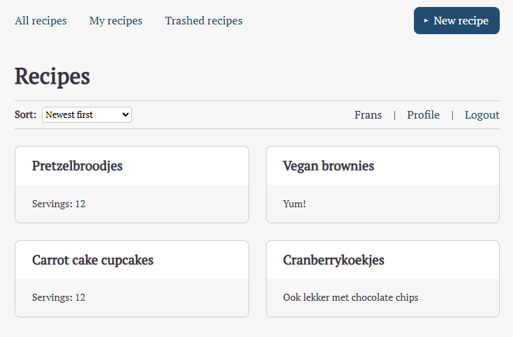

# Spatel

A minimal recipe collection system written in Vue/Nuxt. Allows the user to register an account and add, print and edit recipes. No database required.




## Usage

Build and install to your host of choice, then run.

### Adding recipes

After signing up and logging in, you can add recipes with the "New recipe" button in the top right. All recipes are saved as json files in the server/data/recipes folder.

### User management

All users accounts are saved as json files in the server/data/users folder. A user management page is still on my to-do. You can allow or deny users by adding the email address as an empty file in the server/data/user_Deny or server/data/user_Allow folder. 

### Email functionality

Email account confirmation and password recovery have not been implemented yet.

## Setup

Make sure to install dependencies:

```bash
# npm
npm install

# pnpm
pnpm install

# yarn
yarn install

# bun
bun install
```

## Development Server

Start the development server on `http://localhost:3000`:

```bash
# npm
npm run dev

# pnpm
pnpm dev

# yarn
yarn dev

# bun
bun run dev
```

## Production

Build the application for production:

```bash
# npm
npm run build

# pnpm
pnpm build

# yarn
yarn build

# bun
bun run build
```

Locally preview production build:

```bash
# npm
npm run preview

# pnpm
pnpm preview

# yarn
yarn preview

# bun
bun run preview
```

Check out the [deployment documentation](https://nuxt.com/docs/getting-started/deployment) for more information.
